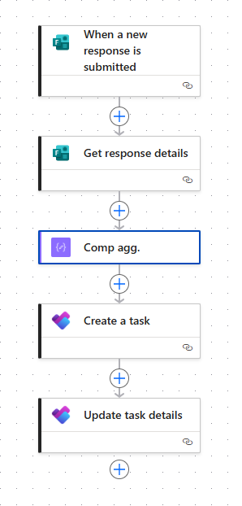
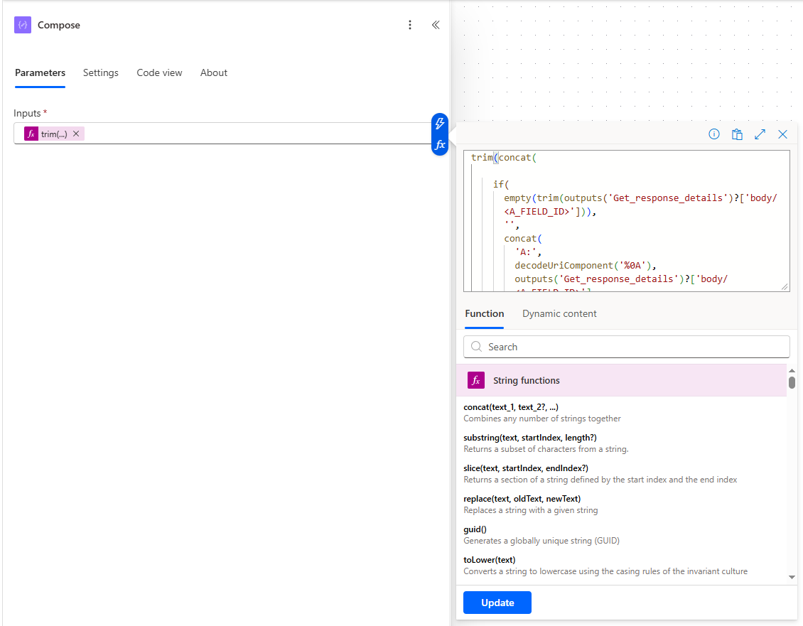

# Power Automate Task Workflow

This flow automates the creation of structured tasks in Microsoft Planner based on form input.

## High-Level Logic:

1. A user submits a Microsoft Form
2. The flow retrieves the response
3. The data is formatted into a structured text block
4. A Planner task is created using the formatted data

## Flow Structure:



## The Flow Consists Of:

1. When a new response is submitted (Forms)
2. Get response details (Forms)
3. Compose (description logic)
4. Create a task (Planner)
5. Update task details (Planner)

## Description Generation (Key Logic)

The task description is generated using a single Compose action with a custom expression.

### Why Use an Expression?

The Planner connector in Power Automate does not handle line breaks like standard text or HTML. Instead of using multiple conditions or Compose steps, this approach:

- Produces consistent formatting
- Avoids unnecessary empty lines
- Reduces flow complexity
- Works reliably with Planner and Teams

## Use This Instead:

```text
trim(concat(

    if(
      empty(trim(outputs('Get_response_details')?['body/<A_FIELD_ID>'])),
      '',
      concat(
        'A:',
        decodeUriComponent('%0A'),
        outputs('Get_response_details')?['body/<A_FIELD_ID>'],
        decodeUriComponent('%0A%0A')
      )
    ),

    if(
      empty(trim(outputs('Get_response_details')?['body/<B_FIELD_ID>'])),
      '',
      concat(
        'B:',
        decodeUriComponent('%0A'),
        outputs('Get_response_details')?['body/<B_FIELD_ID>'],
        decodeUriComponent('%0A%0A')
      )
    ),

    if(
      empty(trim(outputs('Get_response_details')?['body/<C_FIELD_ID>'])),
      '',
      concat(
        'C:',
        decodeUriComponent('%0A'),
        outputs('Get_response_details')?['body/<C_FIELD_ID>'],
        decodeUriComponent('%0A%0A')
      )
    )

))
```

**Add** a modified version of the following code as an **expression** in the **inputs**-field of the compose block:



## How It Works

### If a Value Exists:

- Add label
- Add line break (%0A)
- Add value
- Add spacing (%0A%0A)

### If the Field Is Empty:

- Skip it completely

## Example Input

This is an example of what the form response might contain:

```text
A: {value for A}
B: {value for B}
c: {value for C}
```

## Example Output

This is how the generated Planner description will look:

```text
A:
{value for A}

B:
{value for B}
```

Field C is skipped because it is empty.

## To Adapt the Flow:

- Replace <FIELD_ID> with your own Form field IDs
- Add or remove sections as needed
- Modify labels to fit your use case

---
